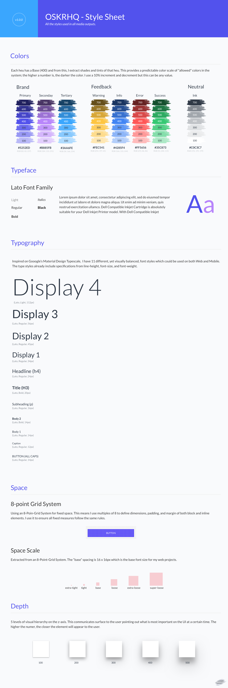

# **OSKRHQ.DS**
This is a Design System created for both Designers and Developers. The system makes use of a CSS architecture based on a shared anatomy (Color, Typography, Space, Depth, and Motion), and a variety of React Presentational Components built from this shared anatomy. The system also has a UI Kit with available Sketch Symbols matching these React Components so Designers and Developers are always in sync. 🤙🏽 

# **Installation**
```sh
npm i --save oskrhq-design-system
```

# **Usage**
1. Include the CSS Architecture in your SCSS files:

```scss
@import 'node_modules/oskrhq-design-system/styles/styles.scss';
```

2. Include any of the provided components in your project:

```javascript
import {DSAvatar, DSButton, DSRadio} from 'oskrhq-design-system';
```

3. Tell React to render the element in the DOM:

```javascript
ReactDOM.render(
    <DSButton type="primary" onClick={() => alert('Button clicked!')}>Press Me</DSButton>,
  document.querySelector('#app')
);
```


## Color

OSKRHQ.DS groups color into 3 types; Brand, Neutral, and Feedback Colors.

- Brand Colors: These establish the personality of the brand. They should be used for accent elements such as primary buttons, CTA's and links.
- Neutral Colors: These are used for things like text, borders, shadows, background colors, etc.
- Feedback Colors: These are used to communicate status to the user and provide them with feedback. 

A color palette is all of these colors put together. OSKRHQ.DS offers a default palette that contains all of these types of colors. 

### Color System
Color follows a predictable scale driven by type and a range. Each heu or color has a Base `(400)` and from this base, I extract shades and tints of that heu. Each variation of this color is given a three-digit rage number. This provides a predictable color scale of "allowed" colors in the system; the higher a number is, the darker the color. 

### Usage
OSKRHQ.DS makes use of Sass Functions to extract colors from each type in a consistent way.

#### `ds-color($type, $range)`

Applies a color from our palette to a CSS property. `$type` refers to the type of color you would like to use (`brand`, `neutral`, `feedback`). `$range` refers to the scale or how dark you would like to color to be. If `$range` is not specified, the color will default to the base color for that type.

```sass
.div-container {
    background-color: ds-color(primary, 700); // returns a hex value for that type of color and its range
}
```

#### Supporting Material
* [Color in Design Ssytems](https://medium.com/eightshapes-llc/color-in-design-systems-a1c80f65fa3)
* [The Color System](https://material.io/design/color/the-color-system.html#color-usage-palettes)


# Typography

OSKRHQ.DS uses Lato as it Font Family with specific typographic styles that define a hierarchy for both mobile and web. 
* Display4
* Display3
* Display2
* Display1
* Headline
* Title
* Subheading
* Body2
* Body1
* Caption
* Button
* Link
* List

## Type System
Font size, font weight, and line-height have their own predictive scales.

### Font Size
I use three digits to convey in size. The higher the range number, the higher the font-size. 
```scss
$ds-base-font-size: 13px;

$ds-font-size-data: (
  display4: $ds-base-font-size * 8,
  display3: $ds-base-font-size * 4,
  display2: $ds-base-font-size * 3.21,
  display1: $ds-base-font-size  * 2.43,
  headline: $ds-base-font-size * 1.72, 
  title: $ds-base-font-size * 1.43,
  subheading: $ds-base-font-size * 1.14,
  body2: $ds-base-font-size,
  body1: $ds-base-font-size,
  caption: $ds-base-font-size * 0.857,
  button: $ds-base-font-size,
  link: $ds-base-font-size,
  list: $ds-base-font-size
);
```

### Font Weight
For font-weight I use words.
```sass
$ds-font-weight-data: (
  display4: (
    light: $ds-base-font-weight * .75,
    base: $ds-base-font-weight,
    semibold: $ds-base-font-weight * 1.5,
    bold: $ds-base-font-weight * 2
  ),
  display3: (
    base: $ds-base-font-weight,
    semibold: $ds-base-font-weight * 1.5,
    bold: $ds-base-font-weight * 2
  ),
  display2: (
   base: $ds-base-font-weight,
    semibold: $ds-base-font-weight * 1.5,
    bold: $ds-base-font-weight * 2
  ),  
  display1: (
    base: $ds-base-font-weight,
    semibold: $ds-base-font-weight * 1.5,
    bold: $ds-base-font-weight * 2
  ),
  headline: (
    base: $ds-base-font-weight,
    semibold: $ds-base-font-weight * 1.5,
    bold: $ds-base-font-weight * 2
  ),
  title: (
    base: $ds-base-font-weight,
    semibold: $ds-base-font-weight * 1.5,
    bold: $ds-base-font-weight * 2
  ),
  subheading: (
    base: $ds-base-font-weight,
    semibold: $ds-base-font-weight * 1.5,
    bold: $ds-base-font-weight * 2
  ),
  body2: (
    base: $ds-base-font-weight,
    semibold: $ds-base-font-weight * 1.5,
    bold: $ds-base-font-weight * 2
  ),
  body1: (
    base: $ds-base-font-weight,
    semibold: $ds-base-font-weight * 1.5,
    bold: $ds-base-font-weight * 2
  ),
  caption: (
    base: $ds-base-font-weight,
    semibold: $ds-base-font-weight * 1.5,
    bold: $ds-base-font-weight * 2
  ),
  button: (
    base: $ds-base-font-weight,
    semibold: $ds-base-font-weight * 1.5,
    bold: $ds-base-font-weight * 2
  ),
  link: (
    base: $ds-base-font-weight,
    semibold: $ds-base-font-weight * 1.5,
    bold: $ds-base-font-weight * 2
  ),
  list: (
    base: $ds-base-font-weight,
    semibold: $ds-base-font-weight * 1.5,
    bold: $ds-base-font-weight * 2
  )
);
```

### Line Height
I use three digits to convey in line-height. The higher the range number, the higher the line-height. 
```sass
$ds-line-height-data: (
  display4: normal,
  display3: normal,
  display2: normal,
  display1: normal,
  headline: normal,
  title: normal,
  subheading: 1.6,
  body2: 1.5,
  body1: 1.5,
  caption: 1.5,
  button: 1.5,
  link: 1.5,
  list: 1.5
);
```

## Usage
I make use of Sass functions and mixins to use in our mark up. 

### Functions

#### `ds-font-size($range)`
Applies a font size from the allowed sizes in the system to a CSS property. `$range` refers to the scale of how big you would like the font-size to be. The higher the number, the bigger the font-size.

```sass
.div-container {
    font-size: ds-font-size(500); // returns a pixel value for that range
}
```

#### `ds-font-weight($weight)`
Applies a font weight from the allowed weights in the system to a CSS property. `$weight` refers to either bold, semibold, base, light, etc.

```sass
.div-container {
    font-size: ds-font-weight(bold); // returns a weight value for that range (300 - 900)
}
```

#### `ds-line-height($range)`
Applies a line height from the allowed line heights in the system to a CSS property. `$range` refers to how high you would like the line-height to be. The higher the number, the higher the line-height.

```sass
.div-container {
    font-size: ds-font-weight(bold); // returns a weight value for that range (300 - 900)
}
```

### Mixins

#### `ds-h1-text-style($color, $weight)`
Applies all the text styling needed by Typographic Style defined in the system to a CSS declaration. `$color` refers to the color in the system you want to use - optional. `$weight` refers to the weight in the system you would like to use - optional. 

```sass
.div-container {
    @include ds-h1-text-style(ds-color(brand, 600), bold);
}
```

#### `ds-h2-text-style($color, $weight)`
Applies all the text styling needed by Typographic Style defined in the system to a CSS declaration. `$color` refers to the color in the system you want to use - optional. `$weight` refers to the weight in the system you would like to use - optional. 

```sass
.div-container {
    @include ds-h2-text-style(ds-color(brand, 600), bold);
}
```

#### `ds-h3-text-style($color, $weight)`

Applies all the text styling needed by Typographic Style defined in the system to a CSS declaration. `$color` refers to the color in the system you want to use - optional. `$weight` refers to the weight in the system you would like to use - optional. 

```sass
.div-container {
    @include ds-h3-text-style(ds-color(brand, 600), bold);
}
```

#### `ds-h4-text-style($color, $weight)`
Applies all the text styling needed by Typographic Style defined in the system to a CSS declaration. `$color` refers to the color in the system you want to use - optional. `$weight` refers to the weight in the system you would like to use - optional. 

```sass
.div-container {
    @include ds-h4-text-style(ds-color(brand, 600), bold);
}
```

#### `ds-h5-text-style($color, $weight)`
Applies all the text styling needed by Typographic Style defined in the system to a CSS declaration. `$color` refers to the color in the system you want to use - optional. `$weight` refers to the weight in the system you would like to use - optional. 

```sass
.div-container {
    @include ds-h5-text-style(ds-color(brand, 600), bold);
}
```

#### `ds-section-header-text-style($color, $weight)`
Applies all the text styling needed by Typographic Style defined in the system to a CSS declaration. `$color` refers to the color in the system you want to use - optional. `$weight` refers to the weight in the system you would like to use - optional. 

```sass
.div-container {
    @include ds-section-header-text-style(ds-color(brand, 600), bold);
}
```

#### `ds-body-text-style($color, $weight)`
Applies all the text styling needed by Typographic Style defined in the system to a CSS declaration. `$color` refers to the color in the system you want to use - optional. `$weight` refers to the weight in the system you would like to use - optional. 

```sass
.div-container {
    @include ds-body-text-style(ds-color(brand, 600), bold);
}
```

#### `ds-body-small-text-style($color, $weight)`
Applies all the text styling needed by Typographic Style defined in the system to a CSS declaration. `$color` refers to the color in the system you want to use - optional. `$weight` refers to the weight in the system you would like to use - optional. 

```sass
.div-container {
    @include ds-body-small-text-style(ds-color(brand, 600), bold);
}
```

#### `ds-body-list-text-style($color, $weight)`
Applies all the text styling needed by Typographic Style defined in the system to a CSS declaration. `$color` refers to the color in the system you want to use - optional. `$weight` refers to the weight in the system you would like to use - optional. 

```sass
.div-container {
    @include ds-body-list-text-style(ds-color(brand, 600), bold);
}
```

#### `ds-body-link-text-style($weight)`
Applies all the text styling needed by Typographic Style defined in the system to a CSS declaration. `$color` refers to the color in the system you want to use - optional. `$weight` refers to the weight in the system you would like to use - optional. 

```sass
.div-container {
    @include ds-body-link-text-style(ds-color(brand, 600), bold);
}
```

### Supporting Material
* [Responsive Typography With Sass Maps](https://www.smashingmagazine.com/2015/06/responsive-typography-with-sass-maps/)
* [The Type System](https://material.io/design/typography/the-type-system.html#type-scale)
* [Modular Scale](http://www.modularscale.com/)


 


# Space

OSKRHQ.DS uses an 8-point grid system as its base for overall space. This means that space uses multiples of 8px to define dimensions, padding, and margin of both block and inline elements. This ensures all measures follow the same spacing rules and avoids many headaches when designers are discussing space with developers. Smaller components, such as iconography and typography, can align to a 4px grid. Regardless of form-factor, most popular screen sizes are divisible by 8 on at least one axis - usually both. This allows us to achieve symmetry in our UI. 

## Spacing System
OSKRHQ.DS provides a predictable scale for fixed space: 

```scss
$ds-spacing-data: (
  none: 0,                           
  extra-tight: 4px,
  tight:       8px,
  base:        16px,
  bit-loose:   24px,
  loose:       32px,
  extra-loose: 48px,
  super-loose: 64px
);
```

## Usage
I make use of Sass functions specify the space I want to apply to objects in our mark up. 

### Functions

#### `ds-space($space)`
Applies spacing rules to a CSS property. `$space` refers to the scale in 8px of how much space you need. The higher the number, the bigger the font-size.

```sass
.div-container {
    padding: ds-space(base) ds-space(tight); // returns a pixel value for those variables
}
```

### Supporting Material
* [Intro to the 8-point Grid System](https://builttoadapt.io/intro-to-the-8-point-grid-system-d2573cde8632)
* [The Layout System](https://material.io/design/layout/understanding-layout.html#usage)


# Depth

OSKRHQ.DS uses z-axis to declare hierarchy.  

## Spacing System
OSKRHQ.DS provides a predictable scale for depth. The higher the number, the closer the item will appear to the user: 

```scss
$shadows-data: (
  500: (0 27px 24px 0 rgba(0, 0, 0, 0.24), 0 40px 77px 0 rgba(0, 0, 0, 0.19)),
  400: (0 16px 28px 0 rgba(0, 0, 0, 0.24), 0 25px 55px 0 rgba(0, 0, 0, 0.19)),
  300: (0 12px 15px 0 rgba(0, 0, 0, 0.24), 0 17px 50px 0 rgba(0, 0, 0, 0.19)),
  200: (0 6px 20px 0 rgba(0, 0, 0, 0.24), 0 8px 17px 0 rgba(0, 0, 0, 0.19)),
  100: (0 1px 5px 0 rgba(0, 0, 0, 0.13), 0 2px 4px 0 rgba(0, 0, 0, 0.2)),
  000: 0 0 0 0 transparent
);

```

## Usage
I make use of Sass functions specify the space I want to apply to objects in our mark up. 

### Functions

#### `ds-space($depth)`
Applies box-shadow rules to the CSS property. `$depth` refers to the how high an item will appear.

```sass
.div-container {
    box-shadow: ds-depth(300); // returns a pixels and an rgba value;
}
```


# Motion

OSKRHQ.DS uses motion to mimic the natural world.   

## Spacing System
OSKRHQ.DS provides a predictable scale for both easing and duration:

```scss
$unit: 100ms;

$duration-data: (
  fast: $unit,
  base: $unit * 2,
  slow: $unit * 3,
  slower: $unit * 4,
  slowest: $unit * 5,
);


$easing-data: (
  base: cubic-bezier(0.64, 0, 0.35, 1),
  in: cubic-bezier(0.36, 0, 1, 1),
  out: cubic-bezier(0, 0, 0.42, 1),
  excite: cubic-bezier(0.18, 0.67, 0.6, 1.22),
  overshoot: cubic-bezier(0.07, 0.28, 0.32, 1.22),
  anticipate: cubic-bezier(0.38, -0.4, 0.88, 0.65),
);
```

## Usage
I make use of Sass functions specify the time and how things should move from one state to another. 

### Functions

#### `ds-easing($variant)`
Applies transitions rules to the CSS property. `$variant` refers to the how the element should move or get to the desired state/position.

#### `ds-duration($variant)`
Applies transition rules to the CSS property. `$variant` refers to the how long the element should take to get to the desired state/position.

```sass
.div-container {
    transition: all ds-easing(in) ds-duration(slowest); // returns a cubic-bezier and the duration in ms.
}
```


 


#### **Not using React?**
I got you. Although you will not be able to take advantage of the react Components, you can still make use of the Shared Anatomy of Styles using SASS. If that is the case, you only have to do step 1. In the `1-base` folder within, you will find what you need. 

#### **Are you a Designer?**
You are not lost, feel free to dig through the code but you will be more interested in the UI Kit which mirrors this repo code. You can find it [here](https://github.com/ogonzal87/oskrhq-uikit).

## Methodology
Read my Medium series [here](https://medium.muz.li/the-anatomy-of-all-digital-interfaces-11d43f55eaf)

## Licenses
* Source code is licensed under [MIT](https://opensource.org/licenses/MIT)

# FAQ's

### What is a Design System?
My definition is as follows: 
> (noun): A product made of living guidelines that communicates a unified set of UX and design decisions which promotes harmony across various media outputs.

### Why should I use a Design System?
If you are here, you already know why. 🤓

### What if the element/component I need is not in the UI Kit?
You can create your own components using the base Anatomy which provides some really useful utility sass functions, mixins and classes.  

### Supporting Material
1) Part I: [The Anatomy of all Interfaces](https://medium.muz.li/the-anatomy-of-all-digital-interfaces-11d43f55eaf)
2) Part II: [Crafting a New Visual Language](https://medium.muz.li/crafting-a-new-visual-language-912d3ac8df43)
2) Part III: [A Dictionary for a Design Language](https://blog.prototypr.io/a-dictionary-for-a-design-language-3afae1579586)


